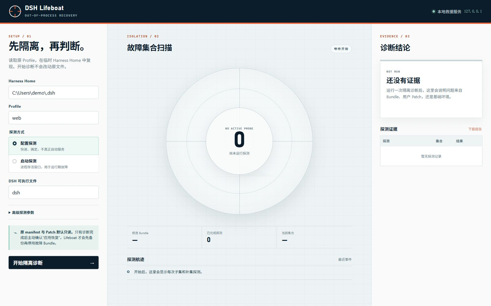

# DSH Lifeboat

English | [简体中文](README.zh.md)

DSH Lifeboat is an out-of-process recovery console for DeepSeek Harness profiles. It can still start when a profile cannot: every probe runs against a temporary `DSH_HOME`, and the original profile manifest and patch files stay read-only until the user explicitly applies a recovery.



## What is included

- A loopback-only Web UI at `127.0.0.1` with live probe progress, evidence, report download, recovery confirmation, and one-step undo.
- A CLI mode that emits the same `dsh-lifeboat/v1` JSON report without the UI.
- Config probes using `dsh --profile <name> --dump-config`.
- Optional runtime probes that treat a clean exit or survival through a configurable startup window as a successful boot.
- Fresh temporary homes for every probe attempt; runtime results are confirmed twice by default and mixed evidence never enables recovery.
- Delta debugging over out-of-tree bundles, including minimal multi-plugin conflict sets.
- Separate checks for profile-level and Harness-home `cordis.patch.yml` failures.
- Optimistic manifest hashing, timestamped backups, and atomic recovery writes.
- A bounded diagnosis queue, graceful process shutdown, `GET /api/health`, browser-session reconnect, and atomically persisted reports.
- A small Harness plugin that writes `~/.dsh/lifeboat/last-healthy.json` only after the Loader settles. The rescue server itself never runs inside the failing Harness process.

## Run from this checkout

Node.js `^22.19.0 || >=24.0.0` is required. There are no runtime dependencies.

```sh
node ./src/cli.js serve
```

Open the printed `http://127.0.0.1:<port>/` address. The default port is `4317`; use `--port 0` for a random free port.

Terminal reports are stored under `$DSH_HOME/lifeboat/reports`. See [service operation](docs/service.md) for systemd and Windows Task Scheduler guidance.

Run without the UI:

```sh
node ./src/cli.js diagnose --profile web
node ./src/cli.js diagnose --profile web --json
node ./src/cli.js diagnose --profile web --mode boot --allow-runtime-code-execution
node ./src/cli.js diagnose --profile web --mode boot --boot-confirmations 3 --allow-runtime-code-execution
```

When `dsh` is run from a Harness source checkout, use safe executable-plus-argument fields instead of a shell command string:

```sh
node ./src/cli.js diagnose \
  --command pnpm \
  --command-arg --dir \
  --command-arg /path/to/deepseek-harness \
  --command-arg dsh \
  --profile web
```

On PowerShell, quote any argument beginning with `--` when necessary.

## Install as a Harness bundle

From the directory that contains this checkout:

```sh
dsh plugin --profile web add ./dsh-lifeboat
```

The package declares `dsh.bundle` through `cordis.patch.yml`. Installation adds the health marker to the selected profile. The rescue UI remains a standalone binary so a broken Loader cannot take it down:

```sh
pnpm --dir "$DSH_HOME/profiles/web" exec dsh-lifeboat serve
```

After publication, the same entry point can be run through the installed package manager or `pnpm dlx dsh-lifeboat`.

## How isolation works

1. Lifeboat reads `$DSH_HOME/profiles/<name>/package.json` and records its SHA-256 hash.
2. Installation-owned bundles stay fixed. Bundles also present in the profile's `dependencies` become candidates.
3. Every probe attempt receives a new direct child named `dsh-lifeboat-*` under the operating-system temp directory.
4. Bounded regular profile assets are copied. Credential-bearing files and symlinked assets are skipped. Installed packages are exposed through absolute package-resolution links so pnpm's relative links remain valid in the temporary profile.
5. The full composition is probed. If it fails, Lifeboat distinguishes clean bundle failures from user-patch failures.
6. For a community-bundle failure, delta debugging tests subsets and complements until it finds a 1-minimal failing set.
7. In runtime mode, inconsistent repeated attempts stop the diagnosis as `unstable-probe` without offering recovery.
8. Each temporary directory is removed after all owned links are unlinked, unless `--keep-artifacts` was selected.

Lifeboat reports a minimal reproduced set, not moral blame. A two-bundle result means the combination failed under the selected probe; it does not prove either package is independently defective.

## Recovery behavior

“Apply recovery” is deliberately unavailable until the report contains a bundle finding. When confirmed, Lifeboat:

1. re-reads the original manifest and rejects the write if its hash changed;
2. saves the exact original file under `.lifeboat-backups/`;
3. atomically replaces `package.json`, removing only the diagnosed bundles from `dsh.profile.bundles`;
4. keeps package dependencies installed;
5. exposes “Undo this recovery” for the same local server session.

Running a later `dsh plugin` package-manager command may reconcile an installed bundle back into the active list. Remove or update the actual faulty dependency after recovery.

## Safety and current limitations

- The server binds only to `127.0.0.1`, rejects non-loopback Host headers, sends a restrictive CSP, and requires a random per-process token for writes.
- Config mode does not mount plugin rows. Runtime mode does execute installed plugin code with the current operating-system user permissions and therefore requires an explicit acknowledgement. The temporary Home isolates configuration and runtime data; it is not an operating-system sandbox for plugin source code.
- Probe processes receive a credential-scrubbed environment. A plugin that requires an API key may therefore fail for an environmental reason; the report preserves this distinction as far as the process result allows.
- Runtime survival is a health heuristic, not proof of full application correctness. Prefer config mode for deterministic loader/configuration failures.
- Relative profile assets are copied up to 32 MiB. Links are skipped and reported, so a profile built around linked local sources may require `--keep-artifacts` and manual inspection.
- The current candidate classifier follows the Harness profile contract: out-of-tree bundle names are active bundles also listed in `dependencies`. Installation-owned bundles are never automatically disabled.
- The current release targets the `dsh.profile.bundles` format used by current pre-release Harness builds. It has not been validated against every historical release.

## Relationship to dsh-guard

Lifeboat was implemented independently. The closest listed community project, [`dsh-guard`](https://github.com/x2802490130-prog/dsh-guard), focuses on rolling snapshots and in-process rollback; its README explicitly notes that an in-process plugin cannot rescue a startup crash without an external launcher. Lifeboat focuses on an independent diagnostic service, fresh-home reproduction, minimal conflict isolation, and evidence-gated recovery. See the [non-ranking comparison](docs/community-overlap.md).

## Development

```sh
npm test
npm run check
npm pack --dry-run --ignore-scripts
```

The project intentionally uses only Node.js built-ins so the rescue path does not acquire another dependency graph that can fail during an incident.
